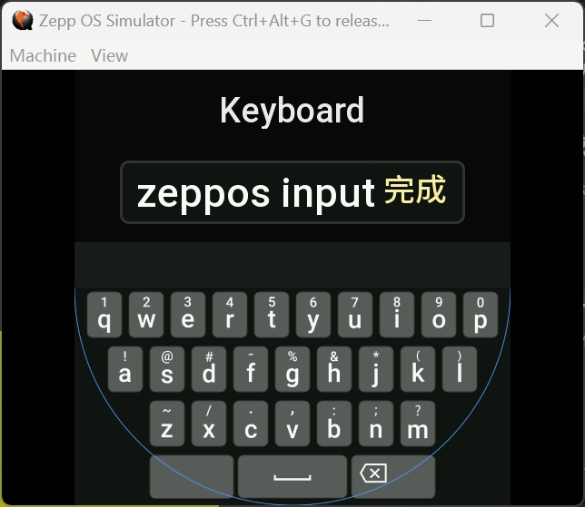
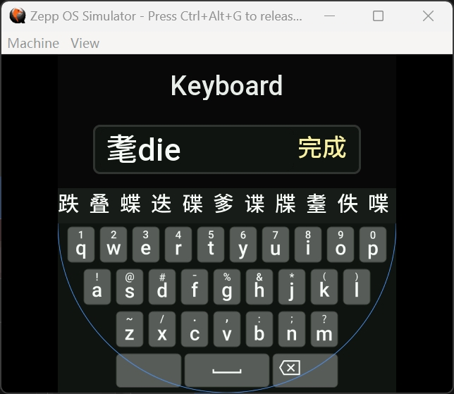

# ZeppOS InputMethod

A flexible, powerful, and visually appealing input method component for ZeppOS.

EN | [中文文档](./README_zh-CN.md)

## Features

- **Multiple Usage Modes**
  - Download and install the official demo directly — ready to use immediately.
  - Embed as a component within your own ZeppOS applications.
- Supports **Scrolling Input**
- Supports **Chinese Pinyin Input**
- **High-performance, object-oriented design** that can be easily extended into the input method you need.
- **Multi-device adaptation** and **multi-language support**.
- **Smooth animation experience** powered by [zeppos-fx](https://github.com/XiaomaiTX/zeppos-fx).
- **Fully customizable theme colors** and support for **custom background images**.

| English QWERTY Layout | Chinese QWERTY Layout |
| --- | --- |
|  |  |

| English QWERTY Demo | Chinese QWERTY Demo |
| --- | --- |
|  |  |

## Important Notes

- Only supports devices running ZeppOS API 4.2 or higher
- Minor issues remain pending official ZeppOS API fixes [Ref #8](https://github.com/XiaomaiTX/zeppos-input-method/issues/8)

## Usage

### Download via Zepp Store

Coming soon — stay tuned.

### Embed as a Component in Your ZeppOS App

```js
import * as hmUI from "@zos/ui";

import { InputMethod } from "../utils/inputMethod";

const prevText = hmUI.keyboard.getTextContext();

const inputMethod = new InputMethod({
    keyboard_type: InputMethod.KEYBOARD_TYPE.ENGLISH,
    inputbox_type: InputMethod.INPUTBOX_TYPE.NORMAL,
    text: prevText,
    title: "Keyboard",
});

inputMethod.start();
inputMethod.delete();

// clean up
onDestroy() {
  console.log("onDestroy");
  hmUI.keyboard.clearInput();
  hmUI.keyboard.inputText(inputMethod.getText());
  inputMethod.delete();
}
```

## Development Guide

### Create a New Keyboard Based on BaseKeyboard

Refer to the implementation of the `ZH_CN_PY` keyboard and modify it according to your needs.

```js
export const KeyBoardLib = {
  EN: class EN extends BaseKeyboard {},
  NUM: class NUM {},
  ZH_CN_PY: class ZH_CN_PY extends BaseKeyboard {
    chooseWord(inputText) {},
    updateChooseWord(event, info) {},
    extractPinyin(inputText) {},
    // ...
  }
};
```

## License

Distributed under the MIT License. See `LICENSE.txt` for more information.

## Contact

XiaomaiTX – <Me@xiaomaitx.com>